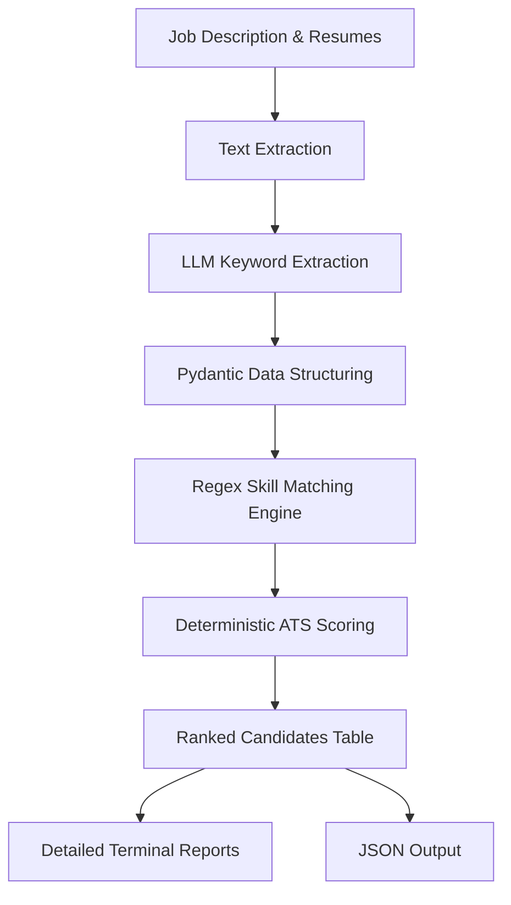

# 🚀 CareerLens AI


> **AI-Powered Applicant Tracking & Resume Screening System**

CareerLens AI is an intelligent Applicant Tracking System (ATS) that automatically analyzes multiple resumes against a job description, ranks candidates, and generates detailed evaluation reports.

Instead of manually reviewing hundreds of resumes, recruiters can upload a folder of resumes and a job description to receive an objective ranking based on skills, experience, and education.

---

## ✨ Features

- 📄 Extracts text from PDF and DOCX resumes
- 🤖 Uses LLMs to structure resume and job description data
- 🎯 Intelligent resume-to-job matching
- 📊 Deterministic ATS scoring engine
- 📈 Candidate ranking system
- 📋 Detailed candidate evaluation reports
- 💾 JSON report generation
- 📁 Batch processing of multiple resumes
- ⚡ Modular architecture for easy extension

---

# Demo

```bash
python -m src.main data/resumes --job jobs/amazon.txt
```

Example Output

```text
Found 3 resume(s).

...

[3/3] Processing: sample_resume.pdf

==================================================
        RESUME MATCH REPORT
==================================================

Candidate : Deep M. Mehta
Match Score : 48.8%

Matched Skills
--------------------
[+] python
[+] java
[+] aws
[+] sql

Missing Skills
--------------------
[-] data structure implementation
[-] go
[-] typescript
[-] object-oriented design
[-] object-oriented design principles
[-] rust
[-] basic algorithm development
[-] version control systems
[-] ai tools for development productivity
[-] debugging and troubleshooting complex systems
[-] cloud platforms
[-] contributing to open-source projects
[-] version control
[-] ai tools
[-] debugging
[-] nosql

Strengths
--------------------
[*] Meets experience requirement

Weaknesses
--------------------
[!] Missing 7 required skills

Recommendation
--------------------
Reject

=========================================================================================================
Rank  Candidate           Score     Required   Preferred   Experience   Decision
=========================================================================================================
1     Deep M. Mehta       48.8%     2/9        2/11        [+]          Reject
2     Priyanshu Singh     41.9%     1/9        1/11        [+]          Reject
3     Ashish Raj          35.0%     0/9        0/11        [+]          Reject
=========================================================================================================

TOP 2 CANDIDATES
--------------------
Deep M. Mehta - 48.8%
Strengths: Meets experience requirement
Weaknesses: Missing 7 required skills

Priyanshu Singh - 41.9%
Strengths: Meets experience requirement
Weaknesses: Missing 8 required skills

LOWEST 2 CANDIDATES
-----------------------
Priyanshu Singh - 41.9%
Strengths: Meets experience requirement
Weaknesses: Missing 8 required skills

Ashish Raj - 35.0%
Strengths: Meets experience requirement
Weaknesses: Missing 9 required skills
```

---

# Project Structure

```text
career-lens-ai
│
├── data/
│   └── resumes/
│
├── jobs/
│   └── amazon.txt
│
├── output/
│   ├── rankings.json
│   ├── report.json
│   └── ...
│
├── src/
│   ├── comparator.py
│   ├── extract_text.py
│   ├── llm_extractor.py
│   ├── main.py
│   ├── model.py
│   ├── report.py
│   ├── scorer.py
│   └── skills_dict.py
│
├── requirements.txt
├── README.md
└── LICENSE
```

---

# 🏗️ Architecture



---

# Tech Stack

### Programming

- Python 3.12+

### AI

- Groq API
- openai/gpt-oss-120b

### Data Validation

- Pydantic v2

### Document Processing

- PyPDF
- python-docx

### Environment

- python-dotenv

---

# Installation

Clone the repository

```bash
git clone https://github.com/jrpandadev/career-lens-ai.git
```

Move into the project

```bash
cd career-lens-ai
```

Create virtual environment

```bash
python -m venv .venv
```

Activate environment

Windows

```bash
.venv\Scripts\activate
```

Linux / macOS

```bash
source .venv/bin/activate
```

Install dependencies

```bash
pip install -r requirements.txt
```

---

# Configuration

Create a `.env` file in the project root.

```env
GROQ_API_KEY=your_api_key_here
```

---

# Usage

Place resumes inside

```text
data/resumes/
```

Place the job description inside

```text
jobs/
```

Run

```bash
python -m src.main data/resumes --job jobs/amazon.txt
```

*(Note: If you omit the `--job` flag, it defaults to `jobs/amazon.txt`)*

---

# Sample Output

For every candidate CareerLens AI provides:

- Overall ATS Score
- Required Skills Matched
- Preferred Skills Matched
- Missing Skills
- Experience Match
- Strengths
- Weaknesses
- Recommendation
- Final Ranking

---

# Scoring Strategy

CareerLens AI evaluates candidates using a strictly deterministic weighted scoring system.

| Criteria | Weight |
|-----------|--------|
| Required Skills | 50% |
| Preferred Skills | 15% |
| Experience | 25% |
| Education | 10% |

The scoring engine is purely math-based, ensuring identical results for identical inputs.

---

# Current Features

- Multiple Resume Screening
- ATS Ranking
- Resume Parsing
- Job Description Parsing
- AI-assisted Information Extraction
- Candidate Comparison
- JSON Reports
- Ranking Table
- Modular Codebase

---

# Future Improvements

- Streamlit Web Interface
- Drag-and-Drop Resume Upload
- CSV/Excel Export
- PDF Reports
- Candidate Dashboard
- Resume Similarity Search
- Skill Gap Analysis
- Recruiter Analytics
- Database Integration
- Authentication

---

# Why CareerLens AI?

Traditional resume screening is time-consuming and subjective.

CareerLens AI helps recruiters by:

- reducing manual effort
- improving consistency
- ranking candidates objectively
- generating explainable evaluations
- supporting batch resume analysis

---

# Contributing

Contributions are welcome.

Feel free to fork the repository, submit issues, or open pull requests.

---

# License

This project is licensed under the MIT License.

---

# Author

**Jyoti**

GitHub: https://github.com/jrpandadev

---

⭐ If you found this project useful, consider giving it a star.
